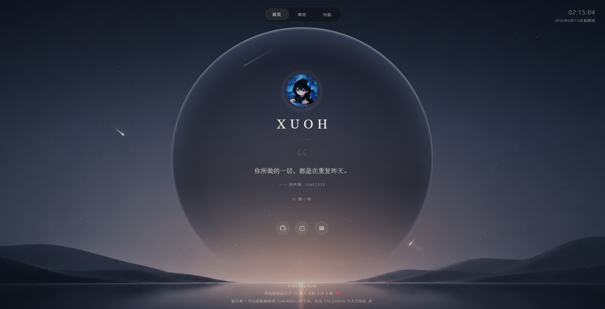

# Xuoh

个人主页 · 墨金主题

纯前端单页站点，部署在 GitHub Pages。主色为墨黑与香槟金，包含自定义光标、背景动效、一言与页脚实时信息等。

## 预览



## 功能

- **墨金视觉**：深色底 + 香槟金点缀，胶片颗粒与光晕圆环
- **自定义光标**：流星拖尾轨迹（桌面端）
- **实时时钟**：右上角显示当前时间与日期
- **一言**：接入 [Hitokoto](https://hitokoto.cn/)，支持手动刷新与自动轮换
- **导航跳转**：首页 / 博客 / 导航页
- **页脚信息**：建站运行时长、旅行者 1 号距地球距离
- **响应式布局**：适配桌面与移动端
- **社交入口**：GitHub、哔哩哔哩、邮箱

## 技术栈

- HTML5 / CSS3 / 原生 JavaScript
- [Hitokoto API](https://v1.hitokoto.cn/) 提供每日一言
- GitHub Pages 托管

## 目录结构

```text
xuoh.github.io/
├── index.html      # 页面结构
├── styles.css      # 样式
├── main.js         # 交互逻辑
├── images/         # 静态资源（头像、背景、图标）
├── LICENSE         # MIT 许可证
└── README.md
```

## 本地预览

本项目无依赖、无构建。用任意静态服务器打开根目录即可，例如：

```bash
# Python 3
python -m http.server 8080

# Node.js (需已安装 serve)
npx serve .
```

浏览器访问 `http://localhost:8080`。

## 自定义

主要配置集中在 `main.js` 的 `CONFIG` 对象，例如：

| 配置项 | 说明 |
| --- | --- |
| `HITOKOTO_API` | 一言接口地址 |
| `BLOG_URL` / `NAV_URL` | 博客与导航页链接 |
| `HITOKOTO_AUTO_INTERVAL` | 一言自动切换间隔（毫秒） |
| `STAR_COUNT_DESKTOP` / `STAR_COUNT_MOBILE` | 星空粒子数量 |

社交链接、文案与 meta 信息可直接在 `index.html` 中修改；主题色与动效在 `styles.css` 中调整。

## 许可证

本项目采用 [MIT License](./LICENSE) 开源。

Copyright (c) 2026 Xuoh
